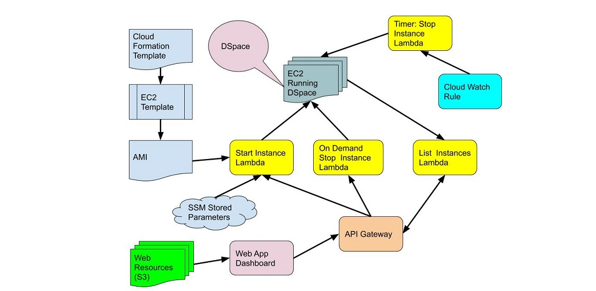

# DSpace Launcher Dashboard - Deploy a DSpace PR in Docker on AWS for Testing

DSpace is an open-source repository platform used by academic libraries and other institutions.
Many institutions have very limited developer support. End users within these institutions have expertise to offer to the project.
This project will build an automated system to build an deploy a test instance of DSpace using code from a specific pull request. 
The system will carefully manage deployed instances in order to control costs.

## Class Presentation

- [Presentation Slides](https://gitpitch.com/terrywbrady/CldAws230)

## Demonstration Video

## Other Notes

- [Project Background and Status](status.md)
